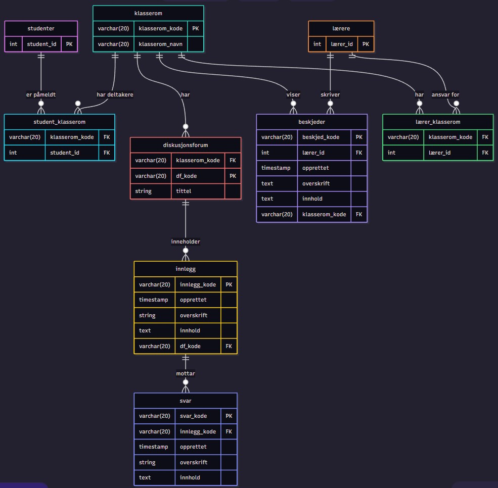

# Oppgavesett 1.4: Databasemodell og implementasjon for Nettbasert Undervisning

I dette oppgavesettet skal du designe en database for et nettbasert undervisningssystem. Les casen nøye og løs de fire deloppgavene som følger.

Denne oppgaven er en øving og det forventes ikke at du kan alt som det er spurt etter her. Vi skal gå gjennom mange av disse tingene detaljert i de nærmeste ukene. En lignende oppbygging av oppgavesettet, er det ikke helt utelukket at, skal bli brukt i eksamensoppgaven.

Du bruker denne filen for å besvare deloppgavene. Du må eventuelt selv finne ut hvordan du kan legge inn bilder (images) i en Markdown-fil som denne. Da kan du ta et bilde av dine ER-diagrammer, legge bildefilen inn på en lokasjon i repository og henvise til filen med syntaksen i Markdown. 

Det er anbefalt å tegne ER-diagrammer med [mermaid.live](https://mermaid.live/) og legge koden inn i Markdown (denne filen) på følgende måte:
```
```mermaid
erDiagram
    studenter 
    ...
``` 
Det finnes bra dokumentasjon [EntityRelationshipDiagram](https://mermaid.js.org/syntax/entityRelationshipDiagram.html) for hvordan tegne ER-diagrammer med mermaid-kode. 

## Case: Databasesystem for Nettbasert Undervisning

Det skal lages et databasesystem for nettbasert undervisning. Brukere av systemet er studenter og lærere, som alle logger på med brukernavn og passord. Det skal være mulig å opprette virtuelle klasserom. Hvert klasserom har en kode, et navn og en lærer som er ansvarlig.

Brukere kan deles inn i grupper. En gruppe kan gis adgang ("nøkkel") til ett eller flere klasserom.

I et klasserom kan studentene lese beskjeder fra læreren. Hvert klasserom har også et diskusjonsforum, der både lærere og studenter kan skrive innlegg. Til et innlegg kan det komme flere svarinnlegg, som det igjen kan komme svar på (en hierarkisk trådstruktur). Både beskjeder og innlegg har en avsender, en dato, en overskrift og et innhold (tekst).

## Del 1: Konseptuell Datamodell

**Oppgave:** Beskriv en konseptuell datamodell (med tekst eller ER-diagram) for systemet. Modellen skal kun inneholde entiteter, som du har valgt, og forholdene mellom dem, med kardinalitet. Du trenger ikke spesifisere attributter i denne delen.

**Ditt svar:**

**Entiteter: klasserom, lærere, studenter, beskjeder,diskusjonsforum, innlegg og svar**.

**Klasserom** har lærer**: Et klasserom kan styres av en eller flere lærere(**m:n**).

**Lærere** sender **beskjed**: Lærere sender ut informasjon til mange (**1:n** - En lærer kan skrive en eller flere beskjeder).

**Klasserom** har **studenter**: Det kan være mange studenter i et klasserom(**m:n** - Et klasserom har mange studenter, og en student kan være i andre klasserom).

**Klasserom** inneholder **diskusjonsforum**: Hvert klasserom kan ha ett eller flere forum(1:n - Klasserommet kan ha mange forum, men tilhører bare klasserommet).

**Diskusjonsforum** består av **innlegg**: Både lærere og studenter oppretter innlegg i forumet(**1:n** - Diskusjonsforumet kan ha mange forumer, men innleggene tilhører bare det spesifikket forumet).

**Innlegg** har **svar**: Et innlegg kan ha mange svar (**1:n** - Ett innlegg kan ha mange svar, men svarene tilhører bare det spesifikket innlegget).


## Del 2: Logisk Skjema (Tabellstruktur)

**Oppgave:** Oversett den konseptuelle modellen til en logisk tabellstruktur. Spesifiser tabellnavn, attributter (kolonner), datatyper, primærnøkler (PK) og fremmednøkler (FK). Tegn et utvidet ER-diagram med [mermaid.live](https://mermaid.live/) eller eventuelt på papir.


**Ditt svar:**



To tredjeparter(student_klasserom og lærer_klasserom) ble laget for å tillate at mange studenter og lærere kan delta i flere klasserom og dermed kan disse koblingstabellene håndtere mange studenter og lærere på tvers av mange fag uten problemer. 

Lærere og studenter-tabellene inneholder bare info om dem(id her), mens klasserom-tabellen inneholder info om rommet(navn og kode) og lærer og student klasserom-tabellen inneholder hvem som er hvor.

## Del 3: Datadefinisjon (DDL) og Mock-Data

**Oppgave:** Skriv SQL-setninger for å opprette tabellstrukturen (DDL - Data Definition Language) og sett inn realistiske mock-data for å simulere bruk av systemet.


**Ditt svar:**
For studenter

- Opprette rolle

```
CREATE ROLE student_1 LOGIN PASSWORD 'student123';
``` 

- Opprette studenter

 ```
 CREATE TABLE studenter (id INT PRIMARY KEY, navn VARCHAR(50));
 ```

- Opprette klasserom

 ```
 CREATE TABLE klasserom (
    klasserom_kode VARCHAR(20) PRIMARY KEY,
    navn VARCHAR(50)
);
```

- Opprette koblingstabell

``` 
CREATE TABLE student_klasserom (
    student_id INT,
    klasserom_kode VARCHAR(20),
    PRIMARY KEY (student_id, klasserom_kode),
    FOREIGN KEY (student_id) REFERENCES studenter(student_id),
    FOREIGN KEY (klasserom_kode) REFERENCES klasserom(klasserom_kode));
``` 

- Gi SELECT-rettigheter til student 
```
GRANT SELECT ON studenter to student_1;
GRANT SELECT ON klasserom to student_1;
GRANT SELECT ON student_klasserom to student_1;
```

For å bruke det:

```
INSERT INTO studenter (id, navn) VALUES (1, 'OLE HENRIKSEN');
INSERT INTO klasserom(klasserom_kode, navn) VALUES ('DATA1500', 'Databaser');
INSERT INTO student_klasserom(klasserom_kode, student_id) VALUES ('DATA1500', 1)
```


## Del 4: Spørringer mot Databasen

**Oppgave:** Skriv SQL-spørringer for å hente ut informasjonen beskrevet under. For hver oppgave skal du levere svar med både relasjonsalgebra-notasjon og standard SQL.

### 1. Finn de 3 nyeste beskjeder fra læreren i et gitt klasserom (f.eks. klasserom_id = 1).

*   **Relasjonsalgebra:**
    > 

*   **SQL:**
    ```sql
    
    ```

### 2. Vis en hel diskusjonstråd startet av en spesifikk student (f.eks. avsender_id = 2).

*   **Relasjonsalgebra**
    > Trenger ikke å skrive en relasjonsalgebra setning her, siden det blir for komplekst og uoversiktlig. 

*   **SQL (med `WITH RECURSIVE`):**

    Du kan vente med denne oppgaven til vi har gått gjennom avanserte SQL-spørringer (tips: må bruke en rekursiv konstruksjon `WITH RECURSIVE diskusjonstraad AS (..) SELECT FROM diskusjonstraad ...`)
    ```sql
    
    ```

### 3. Finn alle studenter i en spesifikk gruppe (f.eks. gruppe_id = 1).

*   **Relasjonsalgebra:**
    > 

*   **SQL:**
    ```sql
    
    ```

### 4. Finn antall grupper.

*   **Relasjonsalgebra (med aggregering):**
    > 

*   **SQL:**
    ```sql
    
    ```

## Del 5: Implementer i postgreSQL i din Docker container

**Oppgave:** Gjenbruk `docker-compose.yml` fra Oppgavesett 1.3 (er i denne repositorien allerede, så du trenger ikke å gjøre noen endringer) og prøv å legge inn din skript for opprettelse av databasen for nettbasert undervsining med noen testdata i filen `01-init-database.sql` i mappen `init-scripts`. Du trenger ikke å opprette roller. 

Lagre alle SQL-spørringene dine fra oppgave 4 i en fil `oppgave4_losning.sql` i mappen `test-scripts` for at man kan teste disse med kommando:

```bash
docker-compose exec postgres psql -U admin -d data1500_db -f test-scripts/oppgave4_losning.sql
```
